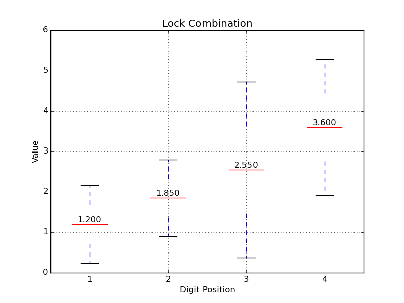

Uncombinator
============

Uncombinator is a combination lock breaker for locks with multiple dials, such as those used on mailboxes and bikes.

When most people lock one of these, they simply swipe the dials once or twice with their thumb and leave. However, this leaves a lot of information behind on the dials. With enough of this information, we can start making progressively more accurate predictions about what the original combination was.

In places where the lock is publicly accessible in its locked state, and the lock is locked and unlocked rather often (say, daily), there is enough information left behind over time to simply deduce the combination!

First, we reset the lock to 0000, and then swipe it with our thumb as a typical user might. Repeated around 25-35 times, we can train a relatively accurate model of lock swiping. This is stored in the `known_data.txt` file.

Then, over multiple unlockings and lockings, we observe the state of the lock after being locked. Repeated around 20-30 times, we can train a relatively accurate model of the user's scrambling over the combination. This is stored in the `hidden_data.txt` file.

The `uncombinator.py` script then reads the data, trains the models, and then calculates the expected combination along with the expected variance.

    anthony@anthony ~/D/P/Uncombinator> python3 uncombinator.py 
    EXPECTED VALUES/STANDARD DEVIATIONS:
    HIDDEN:  (8.95, 9.8, 10.1, 12.0) (0.8046738469715541, 0.7483314773547882, 1.4106735979665885, 1.378404875209022)
    KNOWN:  (7.75, 7.95, 7.55, 8.4) (0.5361902647381804, 0.58949130612758, 1.6575584454250776, 0.9695359714832658)
    EXPECTED COMBINATION/COMBINATION STANDARD DEVIATION:
    (1.1999999999999993, 1.8500000000000005, 2.55, 3.5999999999999996) (0.9669539802906858, 0.9526279441628827, 2.1765798859678918, 1.6852299546352716)
    ========================= THE COMBINATION IS PROBABLY 1234 =========================
    1+-1, 2+-1, 3+-2, 4+-2

Also, it generates cool plots with Matplotlib:

Here's a picture of it in action:

